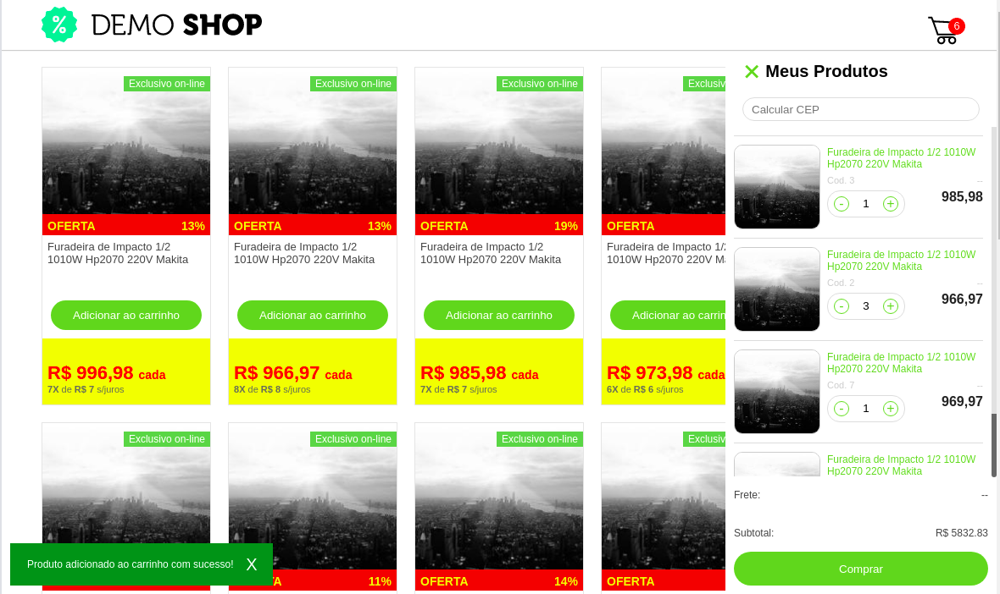

### Virtual Store

Catálogo de produtos e carrinho de compras, desenvolvido com React e Redux




#### Iniciar servidor de desenvolvimento
```
npm run dev
```
#### Gerar build para produção
```
npm run build
```
#### Executar testes de usuário automatizados
```
npm run cypress:open
```
#### Executar testes de unidade
```
npm run upfake
```
#### Executar Back-End fake
```
npm run upfake
```

